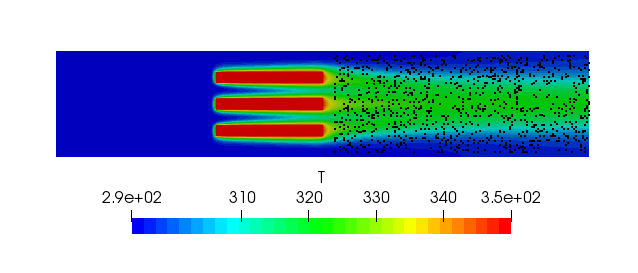

# Inverse PINN: Inferring PDE Coefficients from Data

This example demonstrates how to set up an *inverse* Physics-Informed Neural
Network (PINN) using PhysicsNeMo, `physicsnemo.sym`, and PyTorch. Given the
flow and temperature fields from an OpenFOAM heat-sink simulation, we recover
the unknown kinematic viscosity ($\nu$) and thermal diffusivity ($D$) that
generated the data, by enforcing the governing PDEs as soft constraints.

The goal of this example is to demonstrate the interoperability of
`physicsnemo`, `physicsnemo.sym`, and PyTorch in a custom training pipeline,
and to show how an inverse problem that previously required the
`physicsnemo-sym` `Solver`/`Domain`/`Constraint` abstractions can be expressed
as a short, explicit PyTorch training loop.

This example takes a non-abstracted approach: data loading, the forward pass
through the four networks, the data-fitting loss, the equation residual loss,
and the optimizer step are all written out explicitly. If you previously ran
the equivalent inverse problem in the (now archived)
[`physicsnemo-sym`](https://github.com/NVIDIA/physicsnemo-sym) repository
under the `Solver` / `Domain` / `Constraint` abstractions, see the
[PhysicsNeMo v2.0 Migration Guide](../../../v2.0-MIGRATION-GUIDE.md#physicsnemo-sym--physicsnemosym)
for the high-level mapping, plus the
[Migrating from PhysicsNeMo-Sym](#migrating-from-physicsnemo-sym) section
below for an inverse-problem-specific walkthrough.

## Problem overview

We want to infer two scalar PDE coefficients — kinematic viscosity $\nu$ and
thermal diffusivity $D$ — from observed fields ($u, v, p, T$) generated by an
OpenFOAM simulation of flow past a 2D heat sink. The training data is a
single CSV file sampled in the wake region of the heat sink (boundary points
are excluded so the loss only includes interior conservation laws).



Four networks are trained jointly:

* `flow_net : (x, y) -> (u, v, p)` memorizes the velocity and pressure fields.
* `heat_net : (x, y) -> c` memorizes the scaled temperature.
* `invert_net_nu : (x, y) -> nu` predicts the unknown viscosity field.
* `invert_net_D  : (x, y) -> D` predicts the unknown diffusivity field.

The temperature is scaled to a transport variable $c$ before training:

$$
c = \frac{T_{\text{actual}}}{T_{\text{base}}} - 1, \qquad T_{\text{base}} = 293.498 \text{ K}.
$$

The training objective is

$$
\mathcal{L} = \underbrace{\mathrm{MSE}(\hat{u}, u) + \mathrm{MSE}(\hat{v}, v) + \mathrm{MSE}(\hat{p}, p) + \mathrm{MSE}(\hat{c}, c)}_{\text{data loss}}
\; + \; \underbrace{\| \mathcal{R}_{\text{NS}} \|^2 + \| \mathcal{R}_{\text{AD}} \|^2}_{\text{physics loss}},
$$

where $\mathcal{R}_{\text{NS}}$ are the steady incompressible Navier–Stokes
residuals (continuity, $x$-momentum, $y$-momentum) and
$\mathcal{R}_{\text{AD}}$ is the steady advection–diffusion residual:

$$
\begin{aligned}
\mathcal{R}_{\text{cont}}    &= u_x + v_y, \\
\mathcal{R}_{\text{mom}_x}   &= u u_x + v u_y + p_x - \nu (u_{xx} + u_{yy}), \\
\mathcal{R}_{\text{mom}_y}   &= u v_x + v v_y + p_y - \nu (v_{xx} + v_{yy}), \\
\mathcal{R}_{\text{AD}}      &= u c_x + v c_y - D (c_{xx} + c_{yy}).
\end{aligned}
$$

### The "inverse trick": detached graphs

The key idea that makes the inverse problem trainable is *detaching* the
flow/scalar variables (and their derivatives) inside the residual graphs:

* In the NS residuals, $u, v, p$ and their derivatives are **detached**, so
  gradients from the NS physics loss flow only into `invert_net_nu`.
* In the AD residual, $u, v, c$ and their derivatives are **detached**, so
  gradients from the AD physics loss flow only into `invert_net_D`.

The flow and heat networks therefore learn to fit the OpenFOAM data, while
the inversion networks learn to make the residuals vanish — i.e. to infer the
$\nu$ and $D$ that explain the observed fields. In `physicsnemo.sym` v2.x
this is expressed by passing `detach_names=[...]` directly to the
`PhysicsInformer`.

## Getting started

### Prerequisites

If you are running this example outside of the PhysicsNeMo container, install
PhysicsNeMo with the sym extra:

```bash
pip install "nvidia-physicsnemo[sym]"
```

### Data

The OpenFOAM CSV (`heat_sink_Pr5_clipped2.csv`) is downloaded automatically
on the first run from the PhysicsNeMo NGC supplemental materials bucket. The
URL and target filename are configurable in `config.yaml` under `data:`.

### Training

```bash
python train_inverse_pinn.py
```

Default training settings (in `config.yaml`):

| Setting        | Value          |
| -------------- | -------------- |
| Optimizer      | Adam           |
| Initial LR     | 1e-3           |
| LR schedule    | Exponential, decay rate 0.95 every 500 steps |
| Batch size     | 1024           |
| Max steps      | 50,000         |

Training takes about ~30 minutes on a single modern NVIDIA GPU. Hydra logs
land in `outputs/`, and the script also prints the running mean of the
predicted $\nu$ and $D$ every `log_freq` steps so you can watch the
inversion converge.

## Results

The script logs the spatial mean of the predicted coefficients alongside the
training losses. After 50,000 steps with the default config we recover
coefficients close to the OpenFOAM ground truth:

| Property                                  | OpenFOAM (true) | PINN (predicted) |
| ----------------------------------------- | --------------- | ---------------- |
| Kinematic viscosity $\nu$ (m²/s)          | 1.00 × 10⁻²     | 9.77 × 10⁻³      |
| Thermal diffusivity $D$ (m²/s)            | 2.00 × 10⁻³     | 2.45 × 10⁻³      |

The dataset corresponds to a Prandtl number of 5 ($D = \nu/5$), so the
diffusion term $D \nabla^2 c$ is small compared to advection in the AD
residual. The residual is therefore much less sensitive to $D$ than the NS
residual is to $\nu$, and the recovered $D$ has a larger relative error
($\sim 23\%$) than $\nu$ ($\sim 2\%$). The same behaviour was reported for
this case under the original `physicsnemo-sym` implementation.


## Migrating from PhysicsNeMo-Sym

If you previously ran the equivalent example
([`examples/three_fin_2d/heat_sink_inverse.py`](https://github.com/NVIDIA/physicsnemo-sym/blob/main/examples/three_fin_2d/heat_sink_inverse.py))
in `physicsnemo-sym`, here is what changed in the migration to PhysicsNeMo
v2.0. The science is unchanged — only the API is leaner.

| Concern                  | Old (`physicsnemo-sym`)                                                    | New (`physicsnemo` + `physicsnemo.sym`)                          |
| ------------------------ | -------------------------------------------------------------------------- | ---------------------------------------------------------------- |
| Pre-built PDEs           | `from physicsnemo.sym.eq.pdes.navier_stokes import NavierStokes`           | Define the PDE inline as a `PDE` subclass with SymPy             |
| Network construction     | `instantiate_arch(..., cfg=cfg.arch.fully_connected)` + `Key("u")`         | `physicsnemo.models.mlp.fully_connected.FullyConnected` directly |
| Data ingestion           | `csv_to_dict` + `PointwiseConstraint.from_numpy(...)`                     | `numpy.genfromtxt` + a plain mini-batch loop                     |
| Residual / loss assembly | `make_nodes(detach_names=...)` + `Domain.add_constraint`                   | `PhysicsInformer(..., detach_names=...)` called explicitly       |
| Training loop            | `Solver(cfg, domain).solve()`                                              | Plain PyTorch `for step in range(...)` loop                      |
| Monitoring               | `PointwiseMonitor(..., metrics=...)`                                       | `PythonLogger` + `tensor.mean().item()` in the loop              |
| Configuration            | `physicsnemo.sym.hydra` (`PhysicsNeMoConfig`, `instantiate_arch`)         | Plain Hydra `@hydra.main` + a small `config.yaml`                |


## Additional reading

* [Forward LDC PINN example](../ldc_pinns/) — same non-abstracted style for a
  purely physics-driven (no data) problem.
* [Darcy Flow (DeepONet/FNO)](../darcy_physics_informed/) — physics informing
  data-driven operator models.
* [PhysicsNeMo v2.0 Migration Guide](../../../v2.0-MIGRATION-GUIDE.md).
